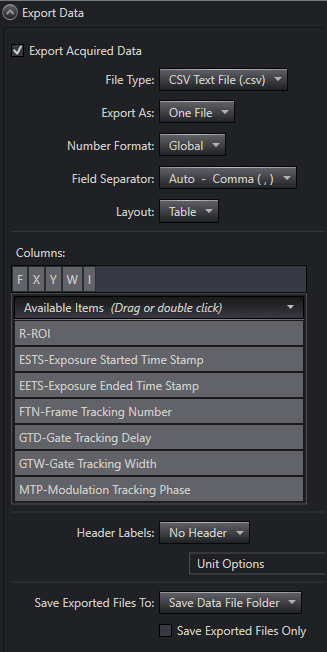
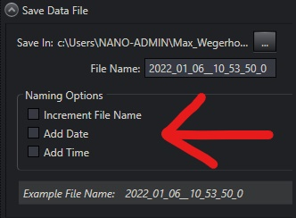

# LightFieldPythonInterface

## Step 1: Create an experiment in Lightfield with your desired settings

Example: I created an experiment called "HRS500_Pixis100_test". Such an experiment must exist for the interface to work. In this experiment one can adjust all the settings as needed beforehand.

However, for the interface to work correctly one must use the following settings in the Export Data tab:



and in the save data file tab:



## Step 2: Acquire spectra through python

Everything else is handled by the python class. For a demo of the class have a look/try the demo: demo_LFPython.py

The most important commands are:
```python
from LFPython import spec

spec = spec(experiment_name = 'HRS500MS_Pixis100_test', folder_name = 'test')
```
to initialize the class based on the lightfield experiment. The data is then saved in a folder which contains a time stamp and the ```python folder_name```.

Calling

```python
spec.acquire()
```
acquires a spectrum and returns the pixel indices + corresponding wavelengths and intensities.
